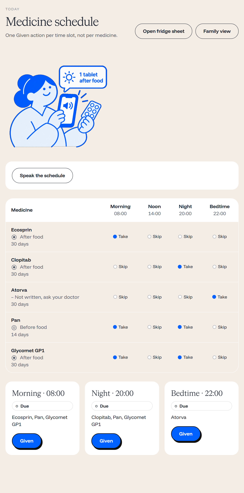
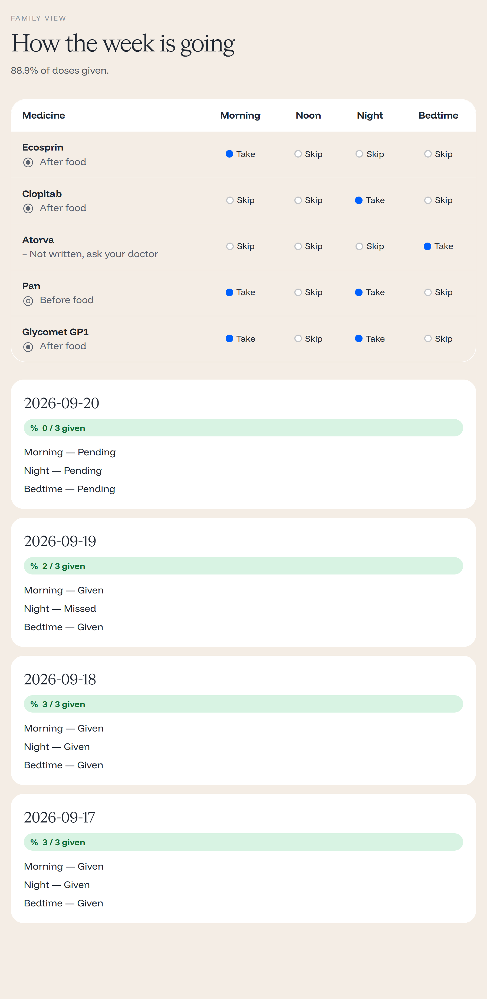
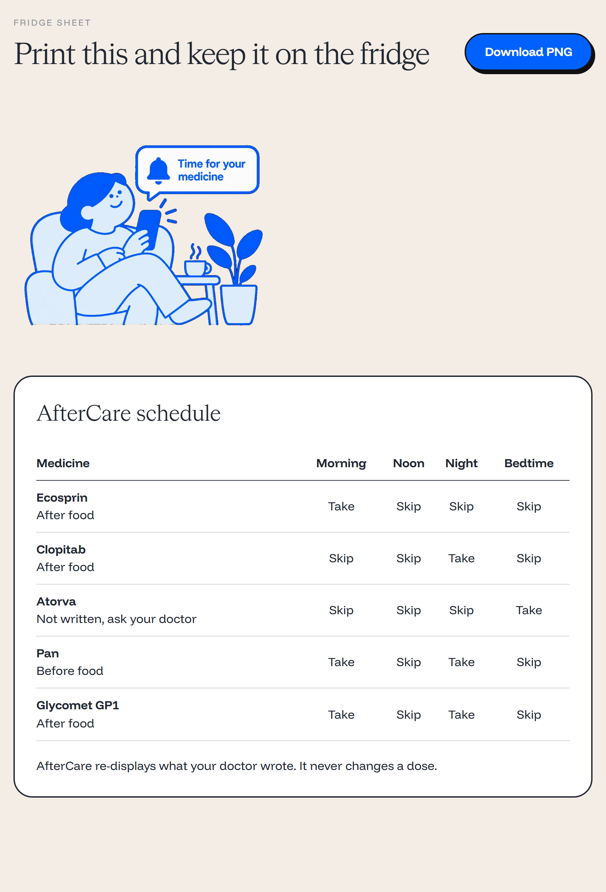
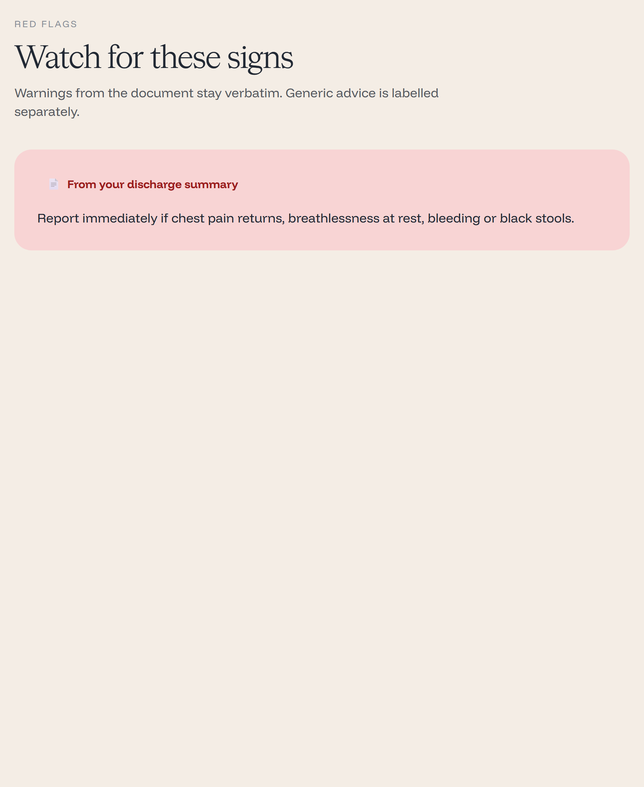

# AfterCare

**Live: https://main.d2nozesb14q5me.amplifyapp.com**

Photograph an Indian hospital discharge summary. Get a picture-and-voice medicine
schedule in your language. Then photograph the strips you bought and check that the
pill box matches the paper.

Built for **First Commit** (WeMakeDevs x AWS Bharat Builds Tour, 17–20 Sep 2026),
**Ship It** track.

> Everyone reads the prescription. We check that the paper matches the pill box.

**AfterCare re-displays what your doctor wrote. It never changes a dose.**

## Why

- Only **31%** of Indian public-hospital discharge notes contain diagnosis,
  medication, lifestyle and follow-up; only **25%** of carers understand them
  ([PLOS ONE](https://doi.org/10.1371/journal.pone.0230438)).
- **70%** of paediatric caregivers do not comply with medication directions
  ([doi:10.1016/j.cegh.2022.101137](https://doi.org/10.1016/j.cegh.2022.101137)).
- **36.8%** of OPD patients poorly understand their prescription and ask for
  vernacular, pictorial formats
  ([doi:10.4103/ijp.ijp_359_24](https://doi.org/10.4103/ijp.ijp_359_24)).

Every existing product turns clinical documents into structure *for the doctor*. We built
this one for the person holding the pill box: an elderly spouse, a domestic helper, a
relative who cannot read clinical English.

## Screenshots

All taken from the live site, on real data.

| Today's medicines | The week |
|---|---|
|  |  |
| One column per time of day, one **Given** tap per slot, and a button that reads the day aloud. "Not written, ask your doctor" is what a blank on the paper looks like. | Adherence over seven days, including the dose that was missed. The family sees everything and can change nothing. |

| Fridge sheet | Warning signs |
|---|---|
|  |  |
| A printable page for a household that does not use a phone. | The warning the discharge summary actually contains, shown word for word. |

## What it does

| Screen | What happens |
|---|---|
| Upload | Photograph the discharge page. JPEG or PNG, 1–10 pages. |
| Review | Every medicine the page contains. Amber lines wait for a human to confirm. Tap a line to see the exact crop of your photo it came from. |
| Schedule | One column per time of day, take or skip per medicine, one **Given** tap per slot. A speaker button reads the day aloud. |
| Box Check | Photograph the strips you bought. Each one comes back *matches*, *look again*, or *do not take*. Never "safe". |
| Family | Seven days of adherence. A son in another city sees everything and changes nothing. |
| Red flags | The warning the document actually contains, or a fixed generic one clearly labelled as such. |
| Fridge sheet | A printable black-and-white page for households that do not use phones. |

A missed dose escalates to the family by Web Push and email after a window the family sets.

The owner signs in with an emailed code. The caregiver never signs up at all: a one-time
invite link is the whole login.

## Safety model

We built the product around three rules, enforced in code and covered by tests:

1. **Never change a dose.** Values are re-displayed, never adjusted or substituted.
2. **Never fill a blank.** If the page does not state a strength or a duration, the app
   shows "not written, ask your doctor" and leaves it empty.
3. **Never say a strip is safe.** Box Check may say matches, look again, or do not take.

How we enforce them: Textract returns every word with its bounding box. The model may only
produce values whose tokens appear in those words, and each medicine line carries the block
IDs it came from. We reject or flag any value the page does not back up. Anything flagged
is amber, and an amber line cannot start a schedule until a human confirms it. We write every
confirmation and edit to an audit record with before and after.

We measured extraction against a ten-case golden set of synthetic discharge summaries:
**91%** accuracy on medicine names, **83%** on strengths. Every remaining error was on a line
already flagged for human confirmation, which is the outcome the design is for.

## Architecture

```
Next.js 15 static PWA (Amplify Hosting)
        |
        v
Lambda Function URL  --  single Python 3.12 function, own router
        |
        +-- Textract DetectDocumentText     words + bounding boxes
        +-- Bedrock Converse (Mistral Large 3)  structuring, grounded in those words
        +-- DynamoDB      one table, single-table design, TTL
        +-- S3            photos and generated audio, presigned uploads
        +-- Cognito       owner sign-in by emailed code
        +-- Polly + Translate   spoken schedule, drug names never translated
        +-- EventBridge Scheduler  one-shot schedule per dose, Asia/Kolkata
                |
                v
        Reminder Lambda  -->  Web Push + SES escalation to the family
```

Everything runs in `ap-south-1`. We keep the caregiver session key in Secrets Manager and the
Web Push signing key in SSM Parameter Store as a SecureString.

We wrote up the decisions and our reasons in [docs/spec.md](docs/spec.md): why a Function URL
instead of API Gateway, why single-table DynamoDB, why one-shot schedules instead of a cron
sweep, and the full extraction pipeline.

## Repository layout

```
api/     Lambda code, one module per area, handler.py routes
infra/   AWS CDK stack (Python), one stack
web/     Next.js 15 static-export PWA
data/    drug ETL, synthetic golden document set
scripts/ demo seeder, web deploy
docs/    spec, API contract, handoff, demo script, submission answers
tests/   410 tests, moto-backed, no cloud calls
```

## Docs

- [System design and specification](docs/spec.md)
- [API contract](docs/api/openapi.yaml)
- [Frontend spec: screens, calls, error table, UI rules](docs/frontend-handoff.md)
- [Handoff: current state and what is left](docs/handoff-next.md)
- [Three-minute demo script](docs/demo-script.md)
- [Submission answers](docs/submission.md)

## Running it

Frontend, anywhere including a Mac, against the deployed backend:

```bash
cd web
cp env.example .env.local
npm install
npm run dev
```

Tests, no AWS credentials needed:

```bash
.venv/Scripts/python -m pytest -q -m "not golden"
```

The extraction accuracy gate needs credentials and the uploaded golden photos:

```bash
GOLDEN_S3_PREFIX=circles/ci_demo/golden python -m pytest -m golden -v -s
```

## Deploying

Backend (needs AWS credentials, PowerShell):

```powershell
.\infra\build.ps1                      # vendors Linux wheels into build/api
npx -y aws-cdk@2 deploy Aftercare
```

Frontend to Amplify Hosting:

```powershell
.\scripts\deploy_web.ps1
```

Seed the demo circle and print a one-time caregiver invite link:

```powershell
.venv\Scripts\python -m scripts.seed_demo --language en --web-origin https://main.d2nozesb14q5me.amplifyapp.com
```

## AWS services used

Lambda (Function URL), DynamoDB, S3, Cognito, Textract, Bedrock, Polly, Translate,
EventBridge Scheduler, SES, Secrets Manager, SSM Parameter Store, Amplify Hosting,
CloudWatch Logs, IAM, CloudFormation via CDK.

Open source AWS stack: AWS CDK (Python), boto3, the Amplify JS library, AWS CLI v2, and moto
for testing against fake AWS services.

## Known limits

We would rather state these than have you find them:

- Box Check can mismatch a salt against its elemental name (calcium carbonate versus
  elemental calcium).
- Uploads accept JPEG and PNG, not PDF.
- No "list my circles" endpoint: an owner who clears browser data loses the link to the circle.
- Polly has no Kannada voice, so Kannada families hear Hindi audio, labelled as such.
- Textract does not read Indic scripts, so only the Latin-script parts of a bilingual page are
  read.
- The account is in the SES sandbox, so emails only reach verified addresses.
- WhatsApp escalation is implemented but switched off.

## Data and attribution

- Brand → molecule mapping: *A-Z Medicine Dataset of India*, CC BY-SA 4.0
  ([Kaggle](https://www.kaggle.com/datasets/shudhanshusingh/az-medicine-dataset-of-india)).
- Test documents are **synthetic**, generated from the blank NABH E-Mitra discharge summary
  template and filled with invented patients. No real patient data exists anywhere in this
  repository.

## Disclaimer

AfterCare is an independent prototype, not a hospital, pharmacy or government service. It does
not give medical advice. For anything medical, contact a doctor or the nearest hospital.
